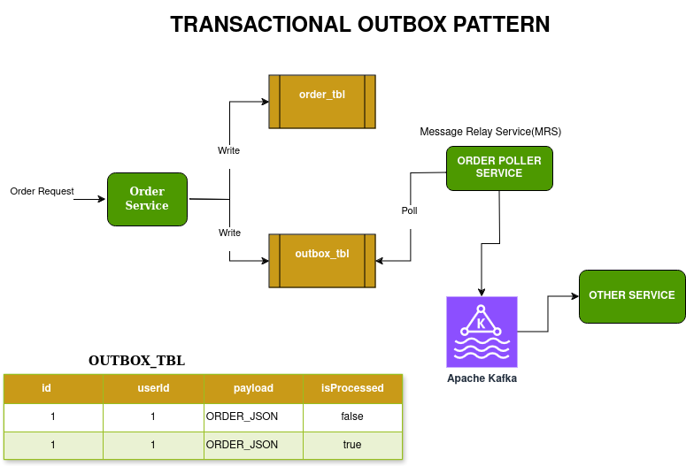
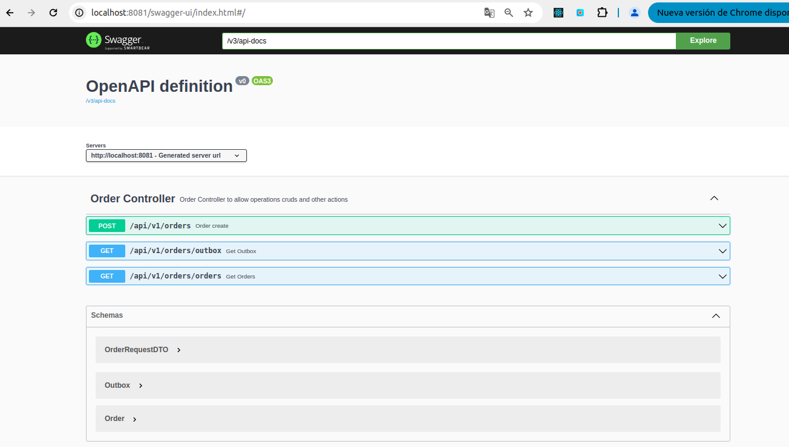
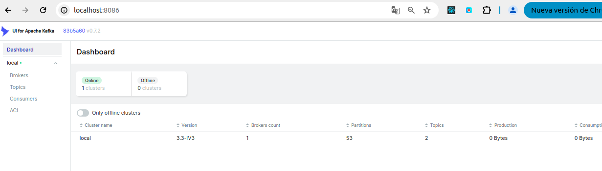

## Outbox Pattern 

The ```Outbox Pattern``` is a design pattern used to ensure data consistency between microservices or between a microservice and external system. It helps to handle the problem of ensuring that messagees are reliably sent when a transaction is committed.

#### Key Concepts:
*  Outbux Table: A dedicated table where events or messages are stored as part of the same transaction that modifies the business data
*  Transaction: When a business operation is performed, the event is stored in the outbox table within the same transaction.
*  Message Relay: A separate process reads the outbox table and sends the messages to the message broker or external system.
  
### Project Outbox Pattern 



In this case the Service **Order Service** write in the tables ```order_tbl``` and write in the table ```outbox_tbl```. The ```outbox_tbl``` table  contains the information that will be used to send to other services . The Service **Order Poller Service** obtanins the information from  table of  ```outbox_tbl``` table of the registered ones that do not process(state in false) and Produces the messages to be  sent to Apache Kafka.


### Technologies 

- Java 21
- Spring Boot 3 
- Docker 
- Kubernetes
- Apache Kakfa 


### Run Application using docker compose from Dockerfile 
In the directory **deployment** run the next command to execute docker-compose : 
```
deployment$  docker compose -f infra.yml  -f apps.yml up 
[+] Running 5/0
 ✔ Container order-db       Created                                                                                                                                                                  0.0s 
 ✔ Container zoo            Created                                                                                                                                                                  0.0s 
 ✔ Container kafka-ui       Created                                                                                                                                                                  0.0s 
 ✔ Container kafka          Created                                                                                                                                                                  0.0s 
 ✔ Container order-service  Created                                                                                                                                                                  0.0s 
Attaching to kafka, kafka-ui, order-db, order-service, zoo
```
In the navigator OpenAPI:
[http://localhost:8081/swagger-ui/index.html](http://localhost:8081/swagger-ui/index.html)



Apache Kafka UI:



### Links  
[Transactional outbox, manejo de eventos transaccionales](https://www.youtube.com/watch?v=vO3WbkmBUaQ)
[Outbox Pattern in Spring Boot 3 and Apache Kafka ](https://dev.to/axeldlv/springkafka-outbox-pattern-in-spring-boot-3-and-apache-kafka-2o3o)
[Integración de Apache Kafka con Spring Boot](https://www.machinet.net/tutorial-es/integrating-apache-kafka-with-spring-boot)
