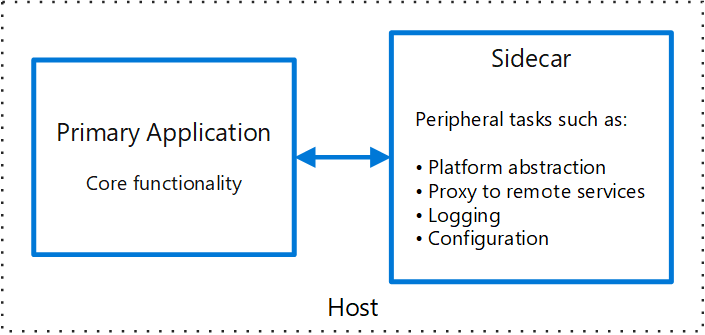
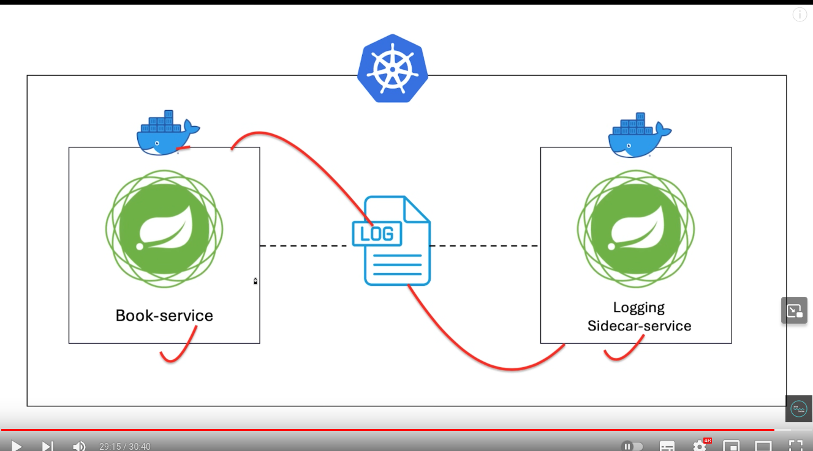
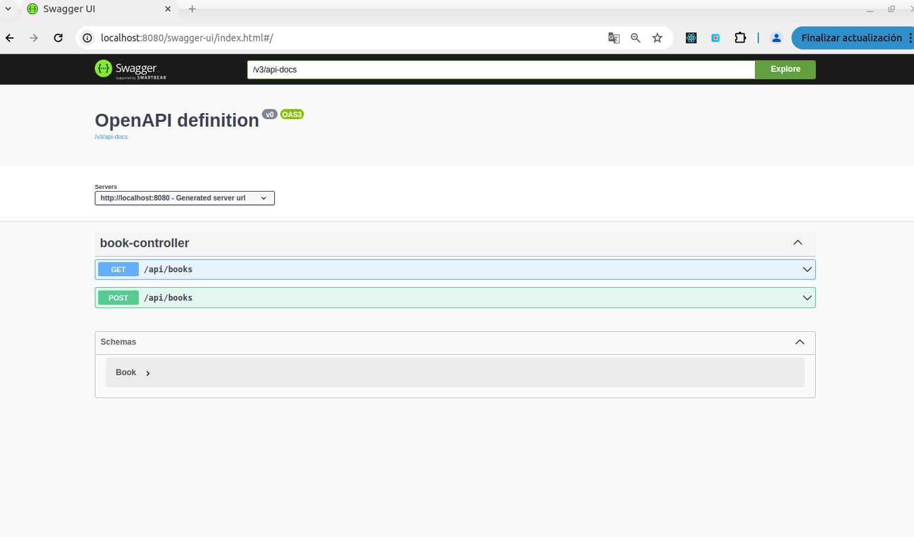
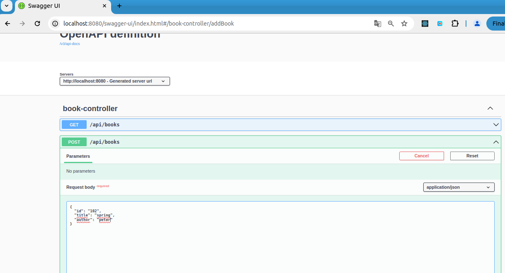

### Pattern Sidecar 

In a microservices architecture, the sidecar pattern is an approach where an additional component is deployed alongside a primary microservice to handle **auxiliary tasks such as communication, security, monitoring, and configuration management**.	
This additional component, known as a **"sidecar,"** runs in the same environment as the microservice (e.g., in the same pod in Kubernetes) and acts as a proxy or agent that extends the capabilities of the microservice without altering its code.

#### Images sidecar




### Common Use Cases

 **Logging and Monitoring**: Sidecar containers can handle log aggregation, log rotation, and forwarding logs to centralized systems like Elasticsearch or Splunk. They can also collect metrics, trace requests, and export them to observability platforms such as Prometheus or Jaeger.
    
 **Service Mesh Integration**: Sidecar containers are a crucial component of service mesh implementations like Istio or Linkerd. They handle traffic management, load balancing, circuit breaking, and secure communication between services, offloading these responsibilities from the main application.
    
 **Security and Authentication**: Sidecar containers can handle security-related tasks such as SSL termination, authentication, and authorization. They can implement protocols like OAuth, JWT, or OpenID Connect to secure communication between services.
    
 **Caching and Content Delivery**: Sidecar containers can provide caching functionality by utilizing solutions like Redis or Memcached. They can cache frequently accessed data, reducing the load on the main application and improving response times.


### Run application example 
The book service application every time saves data to the **"Controller Book"**, this is written to the logs file, the logs file is read by the application **"Loggin Service"**. In this case, use one volume in kubernets to write the file and logs in common to both services.



### Requirements

* docker 
* minikube 
* java 21
* maven


### Create files jar

In the following directories  **/book-service**  and  **/logging-service** run the next command to create, to create file jar.
```
./mvnw clean install -D skipTests
```

In the directorie **/book-service** run the next command : 
```
$ docker build -t manuonda/pattern-sidecar-book-service .

```
In the directorie **/logging-service** run the next command:
```
$ docker build -t manuonda/pattern-sidecar-logging-service .
```
Show de images 
```
$ docker images
REPOSITORY                                                   TAG                  IMAGE ID       CREATED          SIZE
manuonda/pattern-sidecar-book-service                        latest               d2247b7bdbd0   20 minutes ago   533MB
book-service                                                 latest               d2247b7bdbd0   20 minutes ago   533MB
manuonda/patter-sidecar-book-service                         latest               d2247b7bdbd0   20 minutes ago   533MB

```
### Run kubernetes files 

The files kubernetes k8s ``` k8s-deployment.yaml ``` and ```k8s-service.yaml``` 

Run the commands: 

```
$ minikube start 
$ kubectl apply -f k8s-deployment.yaml 
deployment.apps/combined-service created
$ kubectl apply -f k8s-service.yaml 
service/combined-service created
$ kubectl  get pods
NAME                                          READY   STATUS         RESTARTS       AGE
combined-service-f6b64f78d-x65v9              2/2     Running   0              9m14s

$ kubectl get svc
NAME                  TYPE        CLUSTER-IP       EXTERNAL-IP   PORT(S)          AGE
combined-service      ClusterIP   10.107.221.206   <none>        80/TCP,81/TCP    59m

```
Now go to probe the service that expose , run the next commands:
```
$ kubectl port-forward service/combined-service 8080:80
Forwarding from 127.0.0.1:8080 -> 8080
Forwarding from [::1]:8080 -> 8080
Handling connection for 8080
Handling connection for 8080

```

To show the information of the service sidecar-service run the command : 
```
$ kubectl  logs combined-service-b4ccf4455-vw2ws -c sidecar-service 

....
2024-08-18T03:21:12.022Z  INFO 1 --- [logging-service] [   scheduling-1] c.pattern.sidecar.service.LogginService  : Processing log :2024-08-18T02:16:36.949Z  INFO 1 --- [book-service] [http-nio-8080-exec-2] c.p.sidecar.Controller.BookController    : BookControlle::getBooks response [{"id":"string","title":"string","author":"string"},{"id":"string","title":"string","author":"string"},{"id":"string","title":"string","author":"string"},{"id":"string","title":"string","author":"string"},{"id":"string","title":"string","author":"string"},{"id":"string","title":"string","author":"string"},{"id":"string","title":"string","author":"string"},{"id":"string","title":"string","author":"string"}] 
2024-08-18T03:21:12.022Z  INFO 1 --- [logging-service] [   scheduling-1] c.pattern.sidecar.service.LogginService  : Processing log :2024-08-18T03:01:44.977Z  INFO 1 --- [book-service] [http-nio-8080-exec-5] c.p.sidecar.Controller.BookController    : BookControlle::getBooks response [{"id":"string","title":"string","author":"string"},{"id":"string","title":"string","author":"string"},{"id":"string","title":"string","author":"string"},{"id":"string","title":"string","author":"string"},{"id":"string","title":"string","author":"string"},{"id":"string","title":"string","author":"string"},{"id":"string","title":"string","author":"string"},{"id":"string","title":"string","author":"string"}] 


```

In the navigator go to direction url: [http://localhost:8080/swagger-ui/index.html#/]


* Show the next image



Solve the service using swagger-ui, in this case use Post data:




* Show the loggin of patter sidecar in this case 
```
$ kubectl get pods
NAME                                          READY   STATUS    RESTARTS   AGE
combined-service-5bd757d9c6-jcd52             2/2     Running   0          16m
postgresql-deployment-54d4c5dcff-62t7v        1/1     Running   4          10d
springboot-crud-deployment-796df94b8d-7kczh   1/1     Running   16         10d

$ kubectl logs combined-service-5bd757d9c6-jcd52
kubectl logs combined-service-5bd757d9c6-jcd52
Defaulted container "book-service" out of: book-service, sidecar-service

  .   ____          _            __ _ _
 /\\ / ___'_ __ _ _(_)_ __  __ _ \ \ \ \
( ( )\___ | '_ | '_| | '_ \/ _` | \ \ \ \
 \\/  ___)| |_)| | | | | || (_| |  ) ) ) )
  '  |____| .__|_| |_|_| |_\__, | / / / /
 =========|_|==============|___/=/_/_/_/

 :: Spring Boot ::                (v3.3.2)

2024-08-17T03:59:43.912Z  INFO 1 --- [book-service] [           main] c.p.sidecar.BookServiceApplication       : Starting BookServiceApplication v0.0.1-SNAPSHOT using Java 21 with PID 1 (/app/app.jar started by root in /app)
2024-08-17T03:59:43.914Z  INFO 1 --- [book-service] [           main] c.p.sidecar.BookServiceApplication       : No active profile set, falling back to 1 default profile: "default"
2024-08-17T03:59:49.511Z  INFO 1 --- [book-service] [           main] o.s.b.w.embedded.tomcat.TomcatWebServer  : Tomcat initialized with port 8080 (http)
2024-08-17T03:59:49.553Z  INFO 1 --- [book-service] [           main] o.apache.catalina.core.StandardService   : Starting service [Tomcat]
2024-08-17T03:59:49.553Z  INFO 1 --- [book-service] [           main] o.apache.catalina.core.StandardEngine    : Starting Servlet engine: [Apache Tomcat/10.1.26]
2024-08-17T03:59:50.007Z  INFO 1 --- [book-service] [           main] o.a.c.c.C.[Tomcat].[localhost].[/]       : Initializing Spring embedded WebApplicationContext
2024-08-17T03:59:50.007Z  INFO 1 --- [book-service] [           main] w.s.c.ServletWebServerApplicationContext : Root WebApplicationContext: initialization completed in 5857 ms
2024-08-17T03:59:56.025Z  INFO 1 --- [book-service] [           main] o.s.b.a.e.web.EndpointLinksResolver      : Exposing 15 endpoints beneath base path '/actuator'
2024-08-17T03:59:56.312Z  INFO 1 --- [book-service] [           main] o.s.b.w.embedded.tomcat.TomcatWebServer  : Tomcat started on port 8080 (http) with context path '/'
2024-08-17T03:59:56.321Z  INFO 1 --- [book-service] [           main] c.p.sidecar.BookServiceApplication       : Started BookServiceApplication in 14.47 seconds (process running for 16.353)
2024-08-17T04:00:15.711Z  INFO 1 --- [book-service] [nio-8080-exec-1] o.a.c.c.C.[Tomcat].[localhost].[/]       : Initializing Spring DispatcherServlet 'dispatcherServlet'
2024-08-17T04:00:15.712Z  INFO 1 --- [book-service] [nio-8080-exec-1] o.s.web.servlet.DispatcherServlet        : Initializing Servlet 'dispatcherServlet'
2024-08-17T04:00:15.712Z  INFO 1 --- [book-service] [nio-8080-exec-1] o.s.web.servlet.DispatcherServlet        : Completed initialization in 0 ms
2024-08-17T04:00:19.709Z  INFO 1 --- [book-service] [nio-8080-exec-5] o.springdoc.api.AbstractOpenApiResource  : Init duration for springdoc-openapi is: 578 ms
2024-08-17T04:11:10.605Z  INFO 1 --- [book-service] [io-8080-exec-10] c.p.sidecar.Controller.BookController    : BookController::addBook request {"id":"102","title":"spring","author":"peter"}
2024-08-17T04:11:14.924Z  INFO 1 --- [book-service] [nio-8080-exec-8] c.p.sidecar.Controller.BookController    : BookController::addBook request {"id":"102","title":"spring","author":"peter"}
2024-08-17T04:11:18.711Z  INFO 1 --- [book-service] [nio-8080-exec-1] c.p.sidecar.Controller.BookController    : BookController::addBook request {"id":"102","title":"spring","author":"peter"}

```

In the case use only specific service use, to show of pattern sidecar : 
```
kubectl logs combined-service-5bd757d9c6-jcd52 -c sidecar-service 

  .   ____          _            __ _ _
 /\\ / ___'_ __ _ _(_)_ __  __ _ \ \ \ \
( ( )\___ | '_ | '_| | '_ \/ _` | \ \ \ \
 \\/  ___)| |_)| | | | | || (_| |  ) ) ) )
  '  |____| .__|_| |_|_| |_\__, | / / / /
 =========|_|==============|___/=/_/_/_/

 :: Spring Boot ::                (v3.3.2)

2024-08-17T03:59:43.751Z  INFO 1 --- [logging-service] [           main] c.p.sidecar.LoggingServiceApplication    : Starting LoggingServiceApplication v0.0.1-SNAPSHOT using Java 21 with PID 1 (/app/app.jar started by root in /app)
2024-08-17T03:59:43.806Z  INFO 1 --- [logging-service] [           main] c.p.sidecar.LoggingServiceApplication    : No active profile set, falling back to 1 default profile: "default"
2024-08-17T03:59:49.055Z  INFO 1 --- [logging-service] [           main] o.s.b.w.embedded.tomcat.TomcatWebServer  : Tomcat initialized with port 8082 (http)
2024-08-17T03:59:49.109Z  INFO 1 --- [logging-service] [           main] o.apache.catalina.core.StandardService   : Starting service [Tomcat]
2024-08-17T03:59:49.110Z  INFO 1 --- [logging-service] [           main] o.apache.catalina.core.StandardEngine    : Starting Servlet engine: [Apache Tomcat/10.1.26]
2024-08-17T03:59:49.502Z  INFO 1 --- [logging-service] [           main] o.a.c.c.C.[Tomcat].[localhost].[/]       : Initializing Spring embedded WebApplicationContext
2024-08-17T03:59:49.503Z  INFO 1 --- [logging-service] [           main] w.s.c.ServletWebServerApplicationContext : Root WebApplicationContext: initialization completed in 5552 ms
2024-08-17T03:59:50.911Z  INFO 1 --- [logging-service] [           main] c.pattern.sidecar.service.LogginService  : Logging Service initialized...
2024-08-17T03:59:52.809Z  INFO 1 --- [logging-service] [           main] o.s.b.a.e.web.EndpointLinksResolver      : Exposing 1 endpoint beneath base path '/actuator'
2024-08-17T03:59:53.108Z  INFO 1 --- [logging-service] [           main] o.s.b.w.embedded.tomcat.TomcatWebServer  : Tomcat started on port 8082 (http) with context path '/'
2024-08-17T03:59:53.271Z  INFO 1 --- [logging-service] [           main] c.p.sidecar.LoggingServiceApplication    : Started LoggingServiceApplication in 11.066 seconds (process running for 13.242)
```

**Problems to images with minikube** :  sometimes you have a problem, because minikube does not found the images, to solve this problem 
you can upload  images to minikube , in this case run the following command:
```
# upload images to minikube
minikube image load sidecar-logging-service:latest
minikube image load book-service:latest

# Check uploaded images
minikube image ls

# Check deployment
kubectl apply -f k8s-deployment.yaml
kubectl apply -f k8s-service.yaml
```


### Links
[Demystifying Kubernetes Sidecar: Enhancing Microservices Architecture](https://medium.com/@extio/demystifying-kubernetes-sidecar-enhancing-microservices-architecture-c4fe40585c05)

[Handling Cross-Cutting Concerns in Microservices: The Sidecar Pattern](https://blog.bitsrc.io/handling-cross-cutting-concerns-in-microservices-the-sidecar-pattern-59890fe3dc0f)
