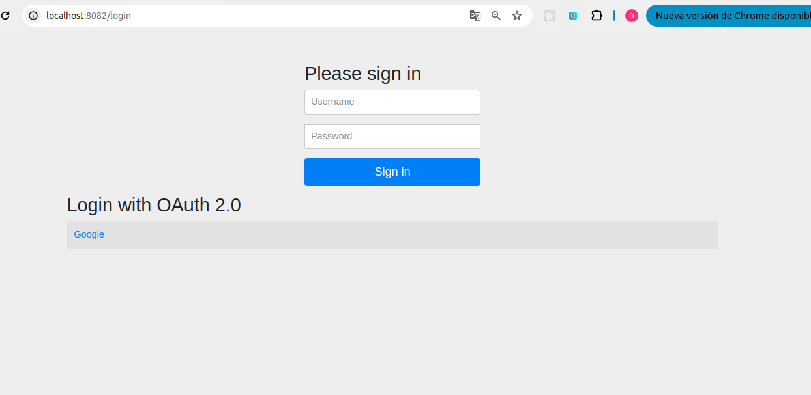
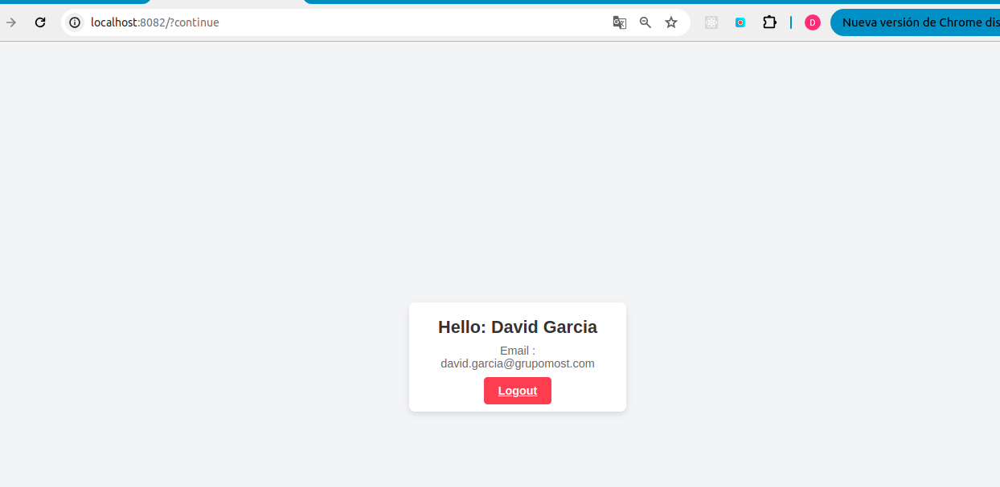

# OAuth2 with Spring Boot and Custom Authentication and Jte

This project demonstrates an OAuth2 implementation using Spring Boot and Spring Security. It also covers custom authentication operations using filters, a dedicated `AuthenticationManager`, and a custom `AuthenticationProvider` to handle user authentication and authorization effectively. 
Then also use of filters.


## Google OAuth2 Setup

1. **Create a Google Cloud Project**:
   - Go to [Google Cloud Console](https://console.cloud.google.com/).
   - Click **Select a Project** > **New Project**.
   - Enter a project name, and click **Create**.

2. **Configure the OAuth Consent Screen**:
   - In the left sidebar, go to **APIs & Services** > **OAuth consent screen**.
   - Choose **User Type** (typically **External** if others will use this app).
   - Provide necessary information, like the app name, support email, and authorized domains.
   - Add any required **Scopes** (e.g., user profile, email).
   - Save and proceed.

3. **Create OAuth2 Credentials**:
   - Go to **APIs & Services** > **Credentials**.
   - Click **Create Credentials** > **OAuth client ID**.
   - Select **Application type** (e.g., Web application).
   - Set up **Authorized redirect URIs** (where users are redirected after authorization).
   - Click **Create** and save the **Client ID** and **Client Secret**.

4. **Enable APIs**:
   - Go to **APIs & Services** > **Library**.
   - Search for and enable any relevant APIs, such as **Google People API** for user profile data.

---

## GitHub OAuth2 Setup

1. **Create a GitHub OAuth App**:
   - Go to [GitHub Developer Settings](https://github.com/settings/developers).
   - Under **OAuth Apps**, click **New OAuth App**.

2. **Fill in App Information**:
   - **Application name**: Enter a name for your app.
   - **Homepage URL**: Enter the URL of your app.
   - **Authorization callback URL**: Specify the redirect URI (where users return after authorization).
   - Click **Register application**.

3. **Get Client ID and Client Secret**:
   - After registering, you’ll see your **Client ID**.
   - Click **Generate a new client secret** to get the **Client Secret**.
   - Save both the Client ID and Client Secret securely.

4. **Configure Scopes (if needed)**:
   - When you make authorization requests, specify any scopes required for your app’s functionality, like `user` or `repo`.

---


### Set environments
```bash
export GOOGLE_CLIENT_ID=your_google_client_id 
export GOOGLE_CLIENT_SECRET=your_google_client_secret
export GITHUB_CLIENT_ID=your_github_client_id
export GITHUB_CLIENT_SECRET=your_github_client_secret
```

### Example user and password 
```
username: dgarcia
password: 12345678
```


### Execute with maven
```maven 
./mvnw spring-boot:run 

```
Next URL: http://localhost:8082/login



Login with ```google``` o ```username and password```, redirect login 




### Link Architecture Spring Security 
* [ Spring Security Architecture Principles by Daniel Garnier-Moiroux @ Spring I/O 2024 ](https://www.youtube.com/watch?v=HyoLl3VcRFY&t=831s)


#### Links OAutClient
* [SpringBoot3 — OAuth2 Login, Default Config — Part 1](https://medium.com/@iyusubov444/springboot3-oauth2-login-default-config-part-1-c35ca2934818)

* [SpringBoot3 — OAuth2 Login Save User Info— Part 2](https://medium.com/@iyusubov444/springboot3-oauth2-login-save-user-info-part-2-f36f5aa5d458)

* [OAuth2 & Spring boot 3 & Social login | never been easier ](https://www.youtube.com/watch?app=desktop&v=2WNjmT2z7c4)

* [OAuth2 Login Made Easy in Java: A Spring Boot & Spring Security Walkthrough](https://www.youtube.com/watch?v=us0VjFiHogo)

* [🔐Spring Security - OAuth2 Client 🌟 Integración con Google y GitHub 🚀](https://www.youtube.com/watch?v=C1c4FNPWu4A)

* [Spring Security + OAuth2 + JTE: Login System Tutorial ](https://www.youtube.com/watch?v=f1h4GkhxMp8&t=628s)


