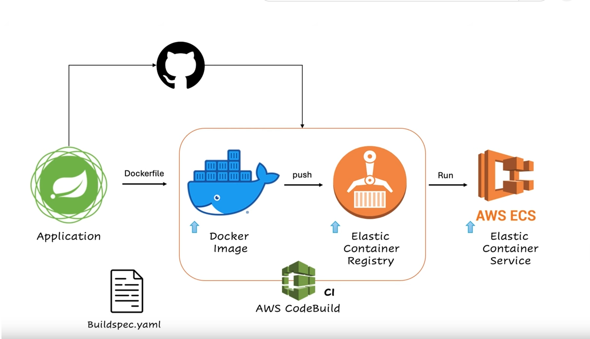
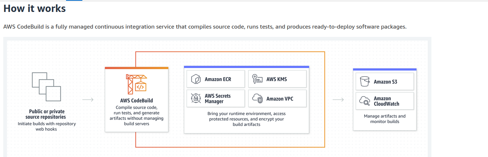
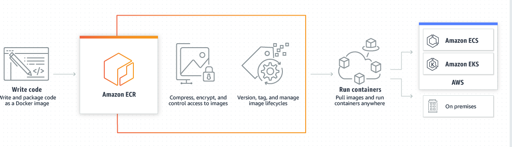
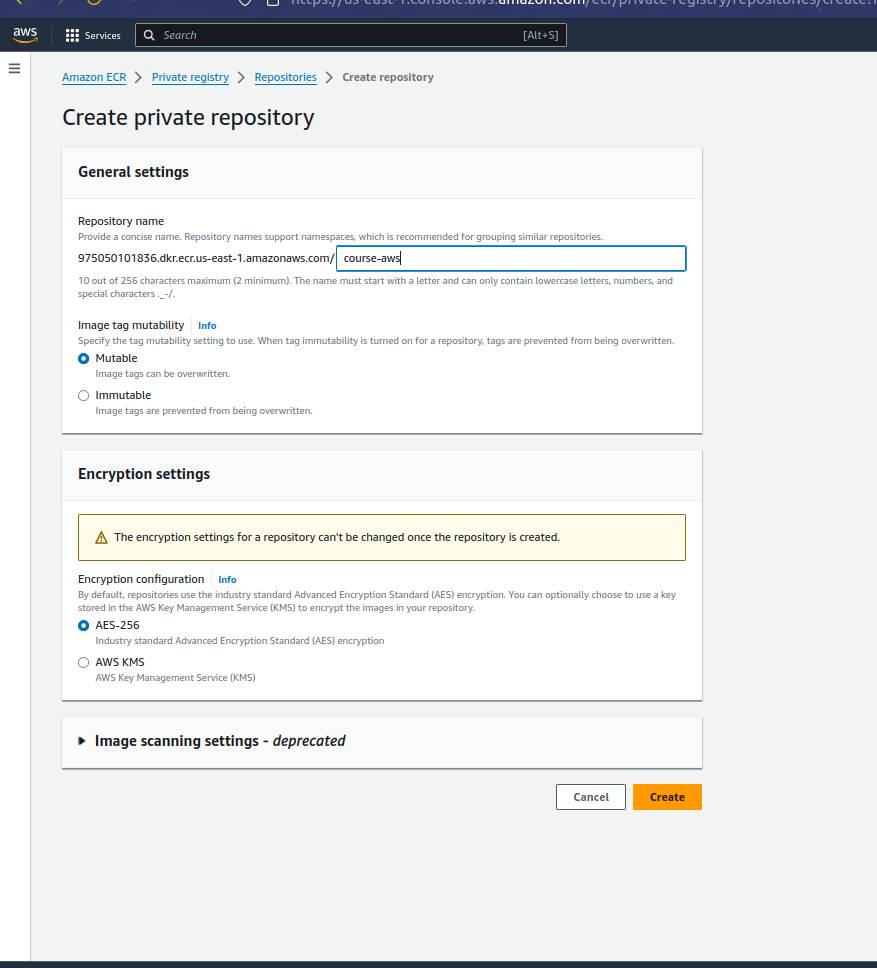
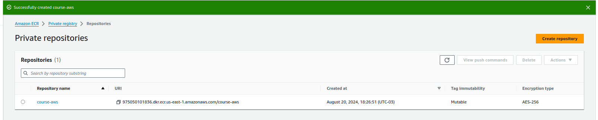
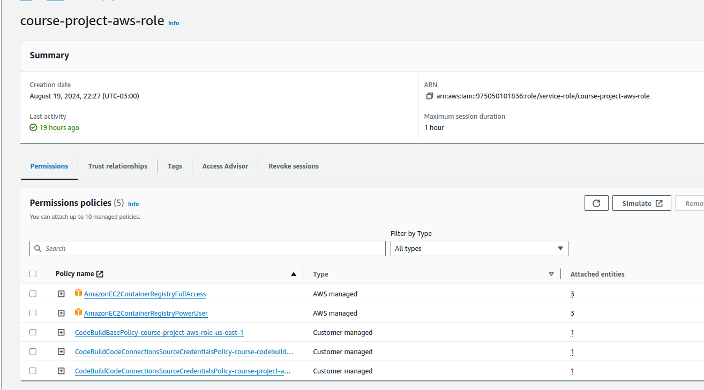
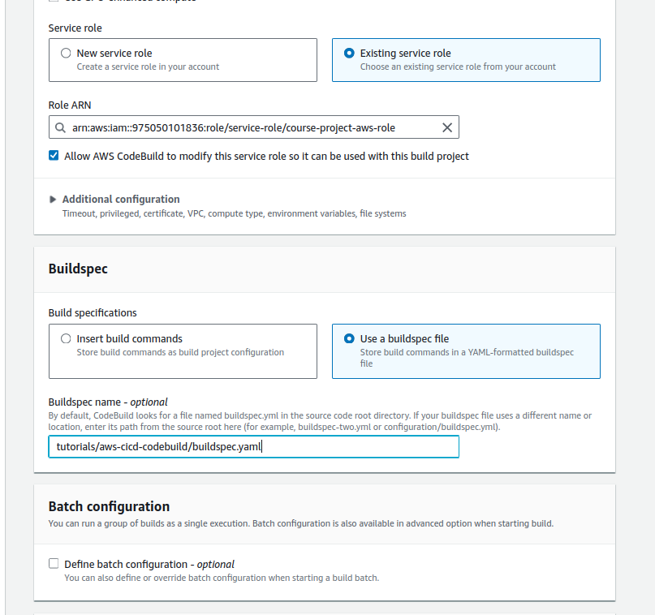
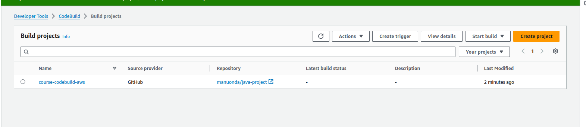

### Deploy Spring Boot to ECS Using CodeBuild & CodePipeline

## Tools Working 
- Aws Codebuild
- Aws ECR(Elastic Container Registry)
- Docker
- Aws ECS(Elastic Container Service)

## AWS CodeBuild 
AWS CodeBuild is a fully managed continuous integration (CI) service provided by Amazon Web Services (AWS). Its primary function is to compile source code, run tests, and produce deployable artifacts. Unlike traditional CI systems that require you to set up and maintain build servers, AWS CodeBuild automatically scales and runs multiple builds in parallel, speeding up your software delivery process.

## AWS ECR( Elastic Container Registry)
Amazon Elastic Container Registry (Amazon ECR) is an AWS managed container image registry service that is secure, scalable, and reliable. Amazon ECR supports private repositories with resource-based permissions using AWS IAM. This is so that specified users or Amazon EC2 instances can access your container repositories and images. You can use your preferred CLI to push, pull, and manage Docker images, Open Container Initiative (OCI) images, and OCI compatible artifacts.

### Steps
1 - File **buildspec.yaml** :  This file contains the instructions for executing the build process.

   *  Location in folder: In this case, tutorials/aws-cicd-codebuild.
   *  Compile application: The Java application is compiled using the Dockerfile.
   *  Login to ECR: Authenticate to the Amazon ECR registry.
   * REPOSITORY_URI: The URL of the repository created in AWS ECR.
   *  Build and upload: Build the application with docker build and upload the image to the repository (AWS ECR).

 **1** - Create repository 
 

 

 **2** - Create role with permissions to ECR.

 

 **3** - Create Codebuild 
  
  Specify that the project to be public and set the repository url github 

 

 **4** -Specify the folder containing the buildspec.yaml file

 

 

 **5** - Build project
 

