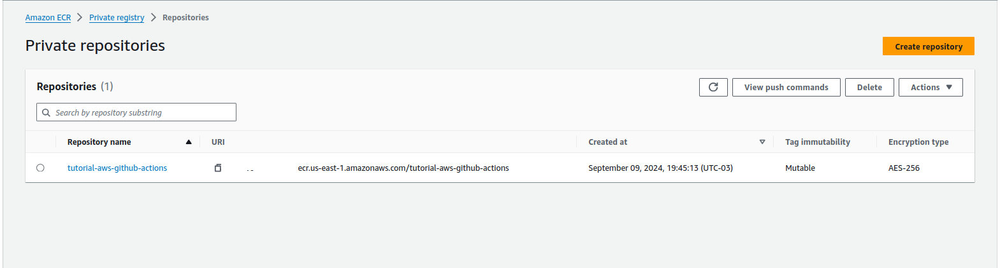

# Spring Boot Application Deployment with GitHub Actions, ECR, and ECS

## Automated CI/CD Pipeline for AWS Elastic Container Service

This project demonstrates how to set up a continuous integration and deployment (CI/CD) pipeline for a Spring Boot application using GitHub Actions, Amazon Elastic Container Registry (ECR), and Amazon Elastic Container Service (ECS).

### Project Overview

1. **Spring Boot Application**: 
   - This project is a simple Spring Boot application that allows Orders to be CRUD operations.
   In this project we will use the next technologies:
   - Spring Boot
   - Spring Data JPA
   - Openapi (Swagger)
   


2. **GitHub Actions Workflow**:
   - Automated build and skip Testing
   - Pushing image to Amazon ECR
   - Deploying to Amazon ECS


3. **Amazon ECR**:
   - Storing Docker images securely

4. **Amazon ECS**:
   - Deploying and running containers
   - Auto-scaling and load balancing

### How It Works

1. **Code Push**: 
   - Developer pushes code to GitHub repository

2. **GitHub Actions Trigger**:
   - Workflow automatically starts on push to main branch

3. **Build and Test**:
   - Spring Boot application is built and tested

4. **Docker Image**:
   - Application is packaged into a Docker image

5. **ECR Push**:
   - Docker image is pushed to Amazon ECR

6. **ECS Deployment**:
   - New image is deployed to ECS cluster

7. **Application Live**:
   - Updated application is now running on ECS

### Setup and Configuration
- Create a user in AWS IAM in this case we create a user with AdministratorAccess to the AWS account


- Add policies to the user


  At this user we can see the Access key ID and the Secret access key, we need to save this credentials in the GitHub repository


- Create a new repository in AWS ECR

 
  We need to get the URI of the repository, this URI is used in the GitHub Actions workflow to push the image to the repository, this URI is used in the workflow to deploy the image to the ECS cluster and the ECR_REPOSITORY

- Go to the repository settings and create a new secrets, AWS_ACCESS_KEY_ID and AWS_SECRET_ACCESS_KEY, AWS_ACCOUNT_ID (this referent to the AWS account) and ```ECR_REPOSITORY ``(Uri of the repository)


### Usage

(Instructions on how to use and deploy the application)

### Contributing

(Guidelines for contributing to the project)

### License

(License information)

