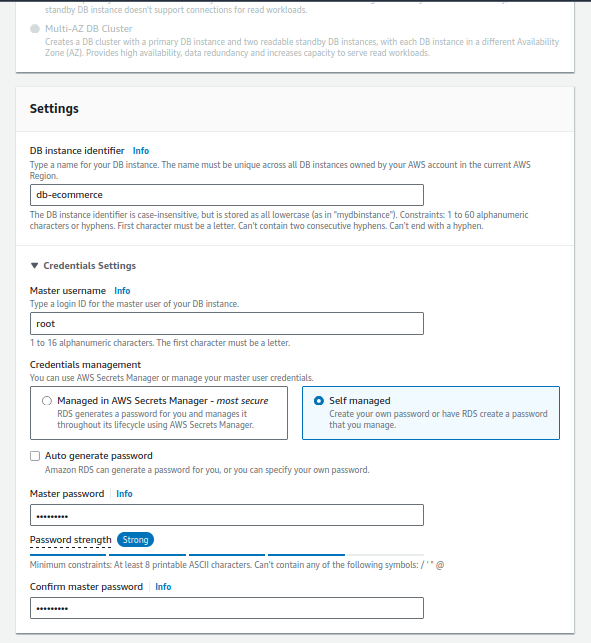
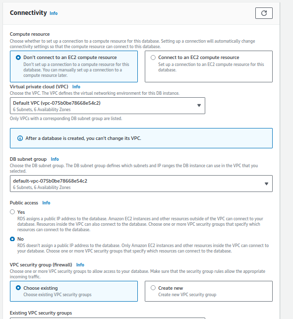
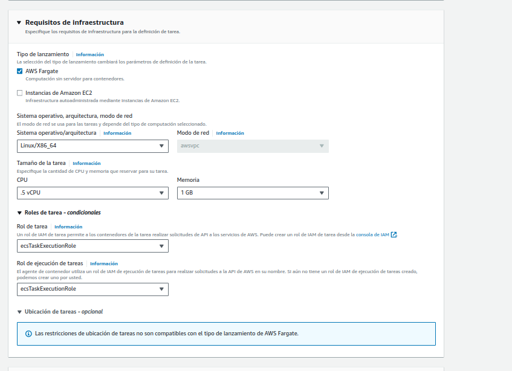
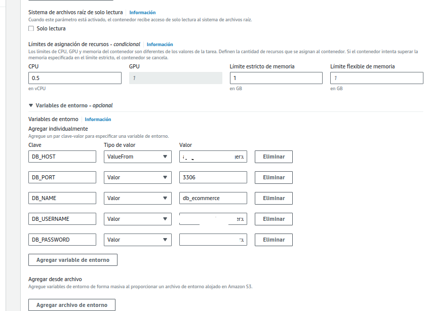
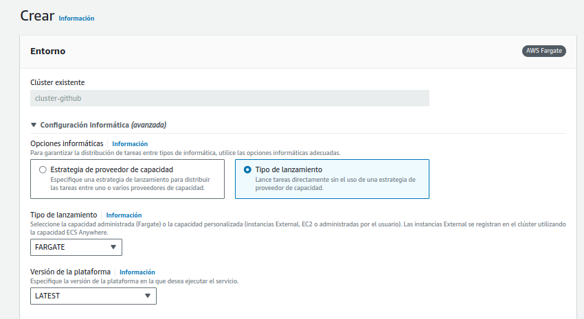
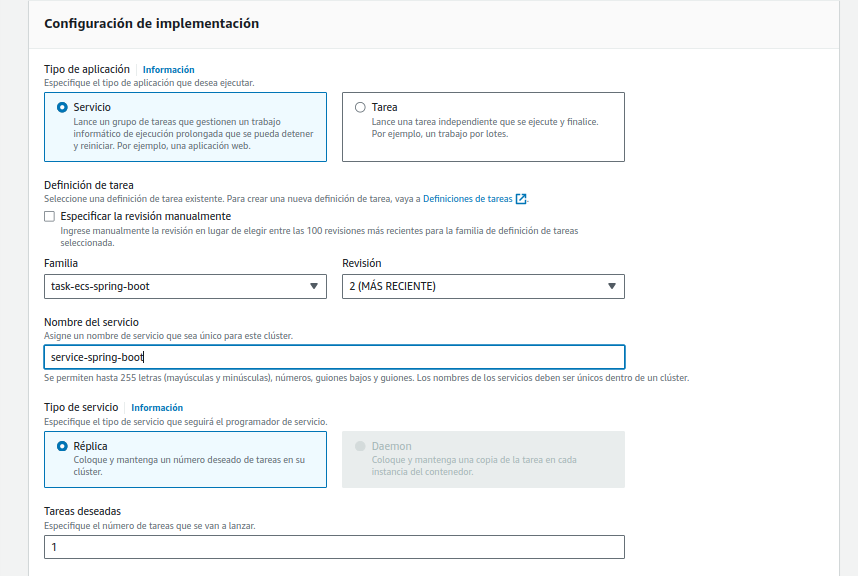
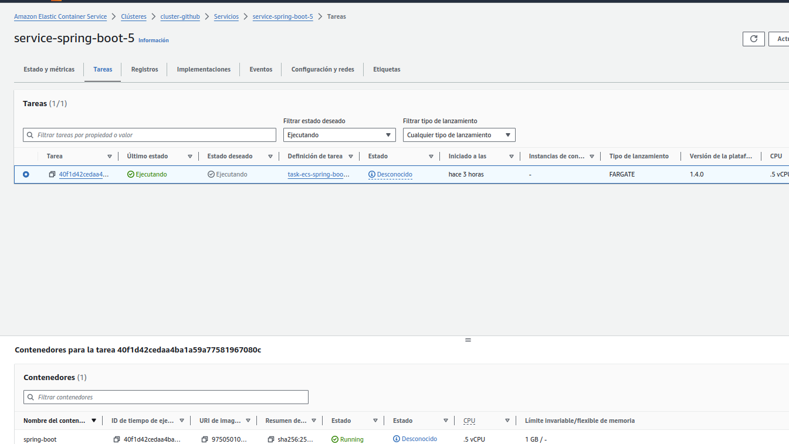
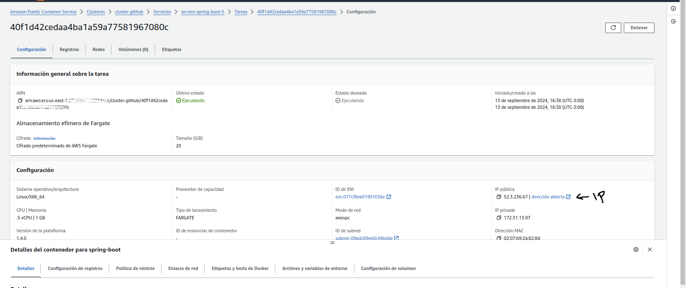
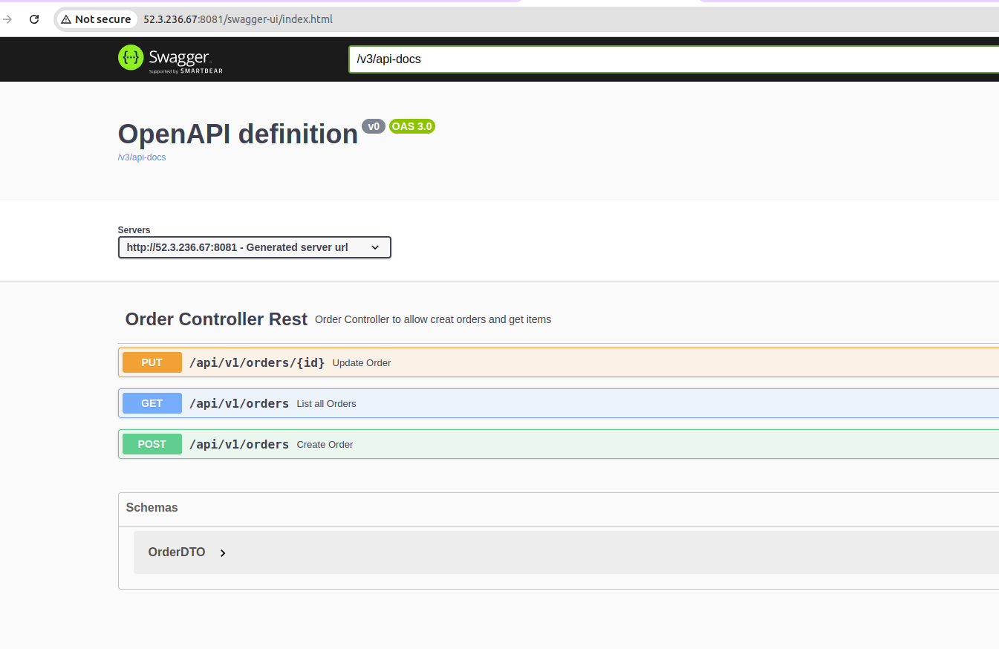

# Spring Boot Application Deployment with GitHub Actions, ECR, and ECS

## Automated CI/CD Pipeline for AWS Elastic Container Service

This project demonstrates how to set up a continuous integration and deployment (CI/CD) pipeline for a Spring Boot application using GitHub Actions, Amazon Elastic Container Registry (ECR), and Amazon Elastic Container Service (ECS).

### Project Overview

1. **Spring Boot Application**: 
   - This project is a simple Spring Boot application that allows Orders to be CRUD operations.
   In this project we will use the next technologies:
   - Spring Boot
   - Spring Data JPA
   - Openapi (Swagger)
   - Docker / Dockerfile
   - GitHub Actions

   


2. **GitHub Actions Workflow**:
   - Automated build and skip Testing
   - Pushing image to Amazon ECR
   - Deploying to Amazon ECS


3. **Amazon ECR**:
   - Storing Docker images securely

4. **Amazon ECS**:
   - Deploying and running containers
   - Auto-scaling and load balancing

### How It Works

1. **Code Push**: 
   - Developer pushes code to GitHub repository

2. **GitHub Actions Trigger**:
   - Workflow automatically starts on push to main branch

3. **Build and Test**:
   - Spring Boot application is built and tested

4. **Docker Image**:
   - Application is packaged into a Docker image

5. **ECR Push**:
   - Docker image is pushed to Amazon ECR

6. **ECS Deployment**:
   - New image is deployed to ECS cluster

7. **Application Live**:
   - Updated application is now running on ECS

### Create docker image and test locally
With the Dockerfile we can create the image container
In the path run the next command :
 ```
 $ ./mvnw clean install -D skipTests 
 
 $ 

```


### Setup and Configuration
- Create a user in AWS IAM in this case we create a user with AdministratorAccess to the AWS account


- Add policies to the user


  At this user we can see the Access key ID and the Secret access key, we need to save this credentials in the GitHub repository

  Create Security Credentiasl for this user.

  Authenticate with this user : ```user-github-actions```

- Create a new repository in AWS ECR in the regions ```us-east-1``` : 
  ***github-actions-first-example***

 
  We need to get the name of the repository is used in the GitHub Actions workflow to push the image to the repository, this URI is used in the workflow to deploy the image to the ECS cluster and the ECR_REPOSITORY

- Go to the repository settings and create a new secrets, the information is referent to user information :
  * AWS_ACCESS_KEY_ID 
  * AWS_SECRET_ACCESS_KEY
  * AWS_ACCOUNT_ID (this referent to the AWS account) 
  * ECR_REPOSITORY ```github-actions-first-example(name of the repository)```


- **Create Database in AWS , in this case using Mysql Database free tier**.








```Creation database name init```


```Database created```


- **Create a cluster**


- **Create a secret manager** variables to use in task definition 


- **Create task Role** 
  


- ***Create task*** in this case , select the Rol ```ecsTaskExecuteRole``` created in the previous step
  


Create infraestructure




Create environments to connect to database,this use the variables create in secrets manager : ```DB_HOST, DB_USERNAME, DB_PASSWORD ```




* **Create Service from Cluster**
  


Select task to work, the most receintly.



Once the service is created , select the task worked on



Select the ip public and click. then open in browser on url and add port 8081.




In case it's correct , this Swagger application opens on the page. 


 


#### Links

