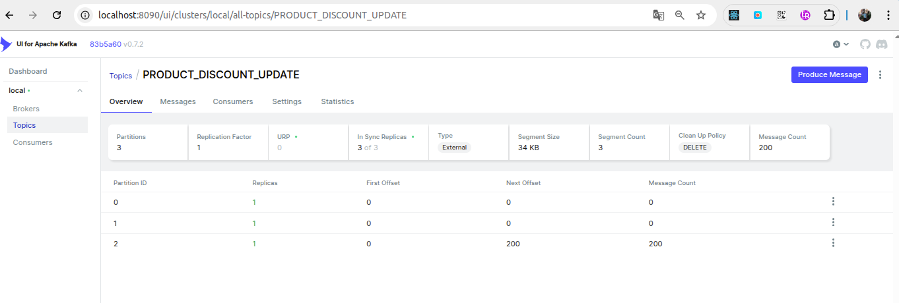

# Spring Boot - Multithreading

## Process Millions of Records in Batches

### Hands-on Example


### Content

1. Introduction
2. Project Setup
3. Dividing Records into Batches
4. Asynchronous Processing with `CompletableFuture`
5. To Execute la application in Docker Compose 
6. Examples
7. Conclusion
8. Links

### 1. Introduction

In large-scale applications, it is common to process large amounts of data. To improve performance, we can divide this data into batches and process them in parallel using multithreading.
Note: This repository is an implementation of a YouTube tutorial by [Java Techie](https://www.youtube.com/@javatechie) 

### 2. Project Setup

In this project, we will use the following technologies:

- Spring Boot
- MySQL
- Kafka
- Kafka UI

### 3. Dividing Records into Batches
To handle large amounts of records efficiently, we divide the total number of records into smaller batches. These batches are then processed concurrently using `CompletableFuture` threads, which allows for parallel processing and improved performance.

To divide the records into batches, you can use a function that splits the data into smaller lists. Here is an example of how to do it:

```java
private List<List<Long>> splitIntoBatches(List<Long> productIds, int batchSize) {
    int totalSize = productIds.size();
    int batchNums = (totalSize + batchSize - 1) / batchSize;
    List<List<Long>> batches = new ArrayList<>();

    for (int i = 0; i < batchNums; i++) {
        int start = i * batchSize;
        int end = Math.min(totalSize, (i + 1) * batchSize);
        batches.add(productIds.subList(start, end));
    }

    return batches;
}
```

### 4. Asynchronous Processing with `CompletableFuture`

Use `CompletableFuture` to process each batch asynchronously:

```java
public void executeProductIds(List<Long> productIds) {
    List<List<Long>> batches = splitIntoBatches(productIds, 50);
    List<CompletableFuture<Void>> futures = batches.stream()
        .map(batch -> CompletableFuture.runAsync(() -> processProductIds(batch), executorService))
        .collect(Collectors.toList());

    CompletableFuture.allOf(futures.toArray(new CompletableFuture[0])).join();
}

private void processProductIds(List<Long> batch) {
    batch.forEach(this::fetchUpdateAndPublish);
}
```


###  5.1 To Execute the application is the next command:
The command ```./mvnw spring-boot:run``` is used to start a Spring Boot application using the Maven Wrapper. Here's a breakdown of what each part of the command does:

```sh 
./mvwn spring-boot:run
```
**Note**: The file ***compose.yaml*** corresponds to Spring boot to use.

### 5.2 To Execute in docker compose

 
 To Execute la application in Docker Compose 
The file of services and application Spring Boot is the next file ```docker-applications-compose.yaml```

To Create Jar to use in Dockerfile is the next command:
```sh ./mvnw clean package -D skipTests ```

To load applications from docker file compos is the next command:
```docker-compose -f docker-applications-compose.yaml```


#### Tool Kafka UI 
To access and view the Kafka topics and the messages being sent, you can go to the URL `http://localhost:8090`.

Topic: 
```http://localhost:8090/ui/clusters/local/all-topics/PRODUCT_DISCOUNT_UPDATE```

To visualize the Kafka UI, refer to the following screenshot:




### 6.  Example CURL Requests

#### Reset Records

```sh
curl --location --request POST 'http://localhost:9393/api/products/reset' --data ''
```

#### Process Records (Traditional Approach)

```sh
curl -w "\nTiempo total: %{time_total}s\n" --location 'http://localhost:9393/api/products/process' \
--header 'Content-Type: application/json' \
--data '[1001,1002,1003,1004,1005,1006,1007,1008,1009,1010,1011,1012,1013,1014,1015,1016,1017,1018,1019,1020,1021,1022,1023,1024,1025,1026,1027,1028,1029,1030,1031,1032,1033,1034,1035,1036,1037,1038,1039,1040,1041,1042,1043,1044,1045,1046,1047,1048,1049,1050,1051,1052,1053,1054,1055,1056,1057,1058,1059,1060,1061,1062,1063,1064,1065,1066,1067,1068,1069,1070,1071,1072,1073,1074,1075,1076,1077,1078,1079,1080,1081,1082,1083,1084,1085,1086,1087,1088,1089,1090,1091,1092,1093,1094,1095,1096,1097,1098,1099,1100]'

```
Output
```sh
Products processed and events published.
Tiempo total: 0.273548s
```

#### Process Records (Multithreading Dynamic Batches)

```sh
curl -w "\nTiempo total: %{time_total}s\n" --location 'http://localhost:9393/api/products/process/v2' \
--header 'Content-Type: application/json' \
--data '[1001,1002,1003,1004,1005,1006,1007,1008,1009,1010,1011,1012,1013,1014,1015,1016,1017,1018,1019,1020,1021,1022,1023,1024,1025,1026,1027,1028,1029,1030,1031,1032,1033,1034,1035,1036,1037,1038,1039,1040,1041,1042,1043,1044,1045,1046,1047,1048,1049,1050,1051,1052,1053,1054,1055,1056,1057,1058,1059,1060,1061,1062,1063,1064,1065,1066,1067,1068,1069,1070,1071,1072,1073,1074,1075,1076,1077,1078,1079,1080,1081,1082,1083,1084,1085,1086,1087,1088,1089,1090,1091,1092,1093,1094,1095,1096,1097,1098,1099,1100]'
```

Measure the execution time for each request to compare performance.

### 7. Conclusion

In this repository, you have in code how to process millions of records in batches using Spring Boot and `CompletableFuture` for parallel processing. This technique can significantly improve the performance of your application by leveraging the power of multithreading.

### 8 Links
[Spring Boot - Multithreading | Process Millions of Records in Batches | Hands-on Example ](https://www.youtube.com/watch?v=qaSBljS6SZk&t=1519s)
[CompletableFuture runAsync() vs. supplyAsync() in Java](https://www.baeldung.com/java-completablefuture-runasync-supplyasync)